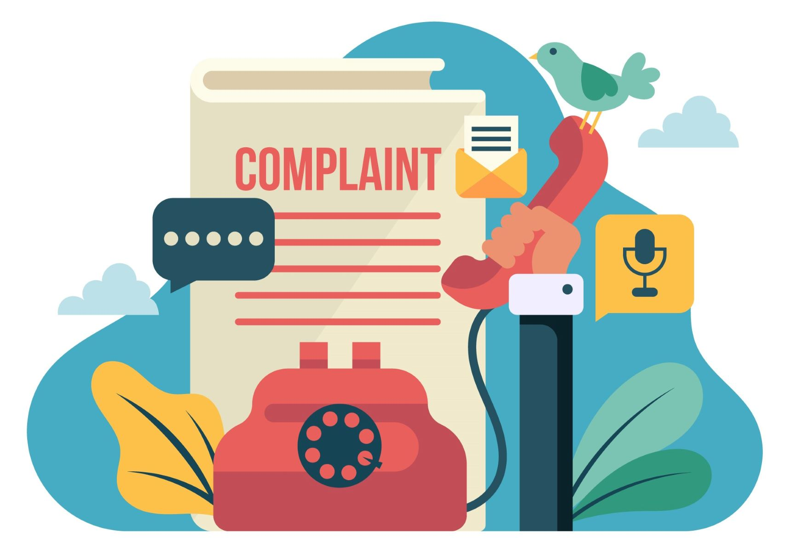

  <h2 align="center" style="margin-top: 0px;">AUTOMATE CLASSIFICATION OF COMPLAINTS</h2>

  
## Key Takeaway: Collected customer complaints are automatically and consistently classified periodically. These classified complaints are analysed based on business objectives on the customer complaint tracking dashboard.

## Author
- [@ChigozieObika](https://www.github.com/ChigozieObika)

## Business problem
A communications company was fined millions of dollars because of the volume of complaints from their customers by a communications regulatory agency. Besides avoiding the fines, the company would like to resolve customers pain points swiftly to avoid losing customers and potentially revenues. The company would also like to have their eyes on complaints hotspots so they can schedule preventive and corrective maintenance projects.

## Summary of Solution
Use a multi-class classifier to identify the type of challenge in customer complaints collected over a period of time (classification model). Create a report on the identified challenges to show the trend of the volume of these challenges over the period under review as well as the volume of the diffent classes of complaints (deployed model). Analyse the identified challenges to investigate the volumes and of the toal and the indivual classes of complaints in the country of operation or in specifis states or group of states (interactive dashboard).

## Data Source
- [Telecom Consumer Complaints](https://www.kaggle.com/datasets/aditya6196/telecom-consumer-complaints)

## Steps to Solution
- Exploratory Data Analysis
- Model Training and Evaluation
- Interactive Dashboard
- Model Deployment

## Tech Stack
- Python (refer to requirement.txt for the packages used in this project)
- Scikit Learn (model training)
- Power BI (Dashboard)
- Flask (model deployment)
- Heroku (web service)

## Summary of Results

### Model Training Journey Map

  

- ***The final model used is: LogisticRegression Classifier***
(Note that though the LGR_nltk classifier has the best performance, the performance gain is not significant compared to the resources employed to achieve it)
- ***Metric for selection is: macro f1 score*** 
- This selection is based on the model with the best score for the applied evaluation metric. This metric was used because it is important to correctly identify the category of complaints (precision) and reduce misclassification (recall). The misclassifications would impact the decision making processes to resolve the business problems.
- The f1 score combines the precision and recall abilities of the model in equal proportions thus creating a balanced model.
- The selected model also has the best scores for accuracy and weighted f1 scores

### Confusion matrix of LogisticRegression Classifier

  

### Deployed App

  

### Interactive Dashboard

  

## Limitation and Recommendations

- The dataset was not labelled by subject matter experts.
- Use a bigger dataset to train the model. 
- Time and computational resources did not allow gidsearchCV for hyper parameter tuning using the dataset and feature engineering from the nltk library.
- Add query capabilities on the deployed model for generating analysis based on users requirements and business goals
- Incorporate dashboard into deployed model

## Contribution

Pull requests are welcome! For major changes, please open an issue first to discuss what you would like to change or contribute.

## License

MIT License

Copyright (c) 2022 Chigozie Obika

Permission is hereby granted, free of charge, to any person obtaining a copy
of this software and associated documentation files (the "Software"), to deal
in the Software without restriction, including without limitation the rights
to use, copy, modify, merge, publish, distribute, sublicense, and/or sell
copies of the Software, and to permit persons to whom the Software is
furnished to do so, subject to the following conditions:

The above copyright notice and this permission notice shall be included in all
copies or substantial portions of the Software.

THE SOFTWARE IS PROVIDED "AS IS", WITHOUT WARRANTY OF ANY KIND, EXPRESS OR
IMPLIED, INCLUDING BUT NOT LIMITED TO THE WARRANTIES OF MERCHANTABILITY,
FITNESS FOR A PARTICULAR PURPOSE AND NONINFRINGEMENT. IN NO EVENT SHALL THE
AUTHORS OR COPYRIGHT HOLDERS BE LIABLE FOR ANY CLAIM, DAMAGES OR OTHER
LIABILITY, WHETHER IN AN ACTION OF CONTRACT, TORT OR OTHERWISE, ARISING FROM,
OUT OF OR IN CONNECTION WITH THE SOFTWARE OR THE USE OR OTHER DEALINGS IN THE
SOFTWARE.

Learn more about [MIT](https://choosealicense.com/licenses/mit/) license
